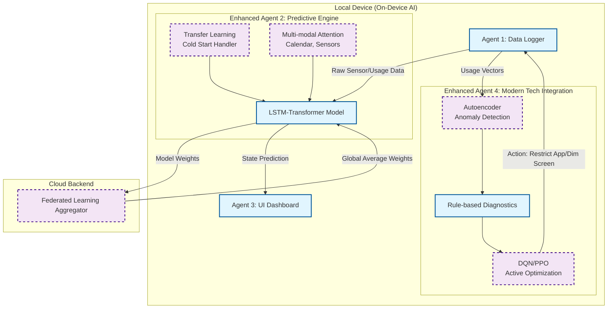

# 🚀 BatteryPulseAI: ML Evolution Roadmap & Future Directions

This document outlines the strategic machine learning (ML) advancements meant to evolve **BatteryPulseAI** from a reactive prediction engine into a **Proactive, Context-Aware Autonomous AI Agent**.

These 5 core evolutionary steps ensure maximum battery efficiency without sacrificing user privacy or UX.

---

## 🏗️ The Evolutionary Architecture Diagram

The following diagram illustrates how the new ML components plug into the existing 4-Agent architecture.

*Note: Solid blue boxes indicate the existing architecture. Dashed purple boxes indicate the newly proposed ML components.*

---

## 1. 🧠 Reinforcement Learning (RL) for Active Intervention
Currently, Agent 4 provides "Recommendations" that the user must manually follow. 
* **The Goal:** Transition from *passive recommendation* to *active optimization* using a **Deep Q-Network (DQN)** or **Proximal Policy Optimization (PPO)**.
* **How it works:** The AI acts as an invisible hand. If it predicts heavy drainage, it actively dims the screen 5%, or pauses non-essential background syncs. 
* **Reward System:** It receives a positive reward for extending battery life, but a negative penalty if the user manually overrides the action (e.g., turning the brightness back up). Over time, it learns the user's exact tolerance threshold for "Silent Optimization".

## 2. 🛡️ Autoencoder-based Anomaly Detection
Battery drain isn't always predictable; rogue apps or hardware degradation can cause sudden drops.
* **The Goal:** Detect and mitigate uncharacteristic power drains instantly.
* **How it works:** An **Autoencoder** (unsupervised learning) trains on the user's normal daily $\vec{p}$ (usage vector). When the user opens a malware app or a buggy update causes an infinite loop, the Autoencoder's *Reconstruction Error* spikes. The system immediately catches this anomaly and quarantines the app before the OS even notices the battery drain.

## 3. 🌍 Federated Learning (Edge AI) Scaling
We promise 100% privacy, but we still want the AI to learn from global trends.
* **The Goal:** Train a smarter global model without ever sending user data to the cloud.
* **How it works:** Leveraging **Federated Averaging (FedAvg)**, the device only sends the mathematical "Weight Delta" of its locally trained LSTM-Transformer to a central server when plugged in and on Wi-Fi at night. The server averages millions of weights and sends back a smarter base model the next morning. 

## 4. ⏱️ Transfer Learning for the "Cold Start" Problem
When a user first installs the app, the prediction $T$ is inaccurate because it lacks historical data.
* **The Goal:** Achieve 95% prediction accuracy on Day 1.
* **How it works:** Embed a pre-trained model mapping to 5 major archetypes (e.g., *Gamer*, *Business*, *Social*). In the first 2 hours of installation, **Zero-shot Classification** determines the user's archetype. We then apply **Transfer Learning** to load that archetype's weights immediately, completely bypassing the "Cold Start" inaccuracy phase.

## 5. 📅 Multi-modal Data Fusion (Context Awareness)
Predicting usage purely based on OS metrics ignores the user's physical reality.
* **The Goal:** Combine spatial, temporal, and OS data to understand the user's true context.
* **How it works:** Use a **Multi-modal Attention Mechanism** to fuse data from the Calendar ("Important Meeting from 2-4 PM"), Light Sensor (Pitch black room), and Accelerometer (Phone is face-down). If all these align, the AI *knows* the phone won't be used for 2 hours and can immediately plunge the 5G modem and CPU into deep sleep, saving massive amounts of power proactively.
