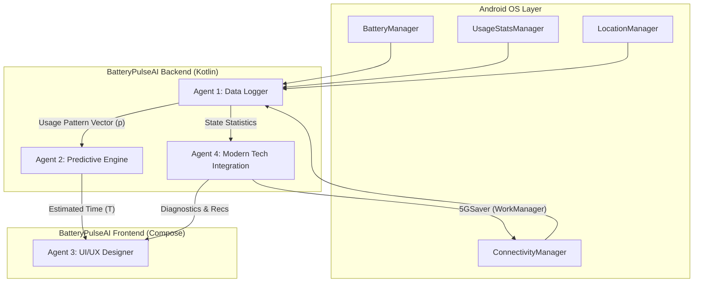
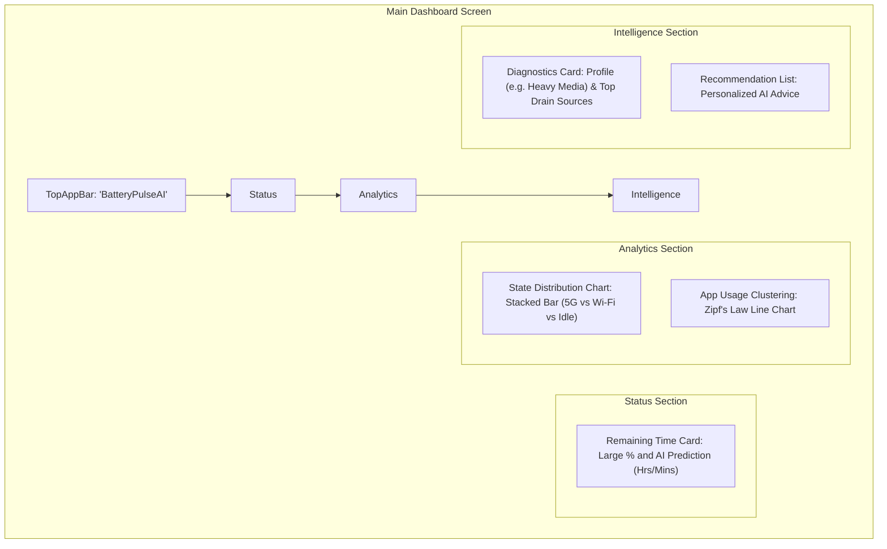
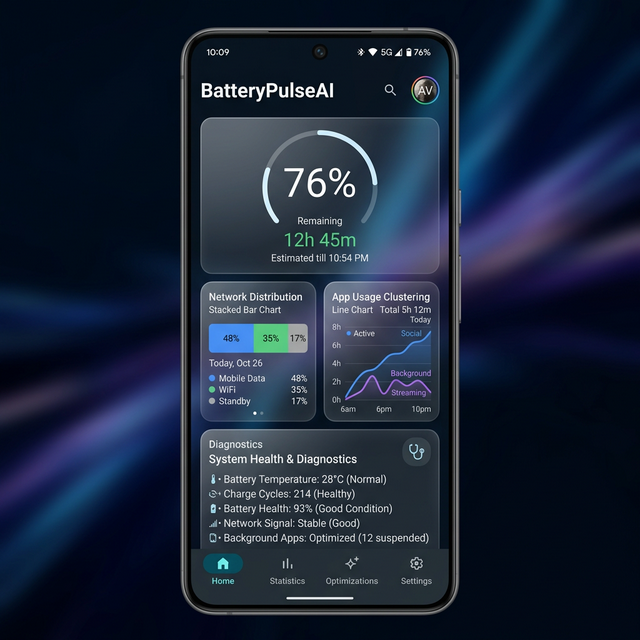

# 🏗️ BatteryPulseAI System Design

## 1. Overview
BatteryPulseAI is an intelligent battery management system that merges classical battery lifetime prediction principles (from 2011 research) with modern Android 15 capabilities. It goes beyond simple percentage tracking by analyzing multi-dimensional usage patterns to provide high-precision remaining time estimates and proactive power optimization.

## 2. Requirements
### Functional Requirements
- **Real-time Data Logging:** Collects battery status, app statistics, network (5G/Wi-Fi), and hardware sensor (GPS, BT) states at 1-second intervals.
- **Predictive Engine:** Estimates remaining time using the formula $T = V / \sum(p_i \cdot B_i)$ based on collected vectors.
- **5GSaver:** Intelligent network batching to preserve "Radio Tail" energy in 5G/6G environments.
- **Intelligent Diagnostics:** Analyzes user patterns to generate personalized battery-saving recommendations.
- **Pattern Visualization:** Visualizes app usage using Zipf’s Law and displays hardware state distribution.

### Non-Functional Requirements
- **On-Device AI:** All data processing is performed locally to ensure user privacy.
- **Low Power Overhead:** Optimized logging services to minimize the app's own battery footprint (utilizing NPU and efficient querying).
- **Premium UX:** Modern, responsive UI built with Jetpack Compose.

## 3. High-Level Design (Architecture)

## 4. UI Design & Layout

The UI is designed to be "Glassmorphic" and data-rich, providing users with both high-level status and deep-dive analytics.

### Dashboard Layout Diagram

### UI Component Details
1. **Glassmorphic Cards:** High-contrast primary cards for Battery % and Remaining Time to grab immediate attention.
2. **Dynamic Charts (Agent 3):**
    - **Stacked Bar:** Uses a custom `Canvas` to show real-time distribution of radio and sensor activity.
    - **Zipf's Law Line:** A smooth curve showing the "Long Tail" of app usage, highlighting how a few apps dominate the battery profile.
3. **Actionable Diagnostics:** A dedicated panel that translates complex multidimensional vectors into human-readable advice (e.g., "Your 5G usage is high, consider Wi-Fi for video streaming").

## 5. Detailed Component Design

### Agent 1: Data Logger Specialist
- **Core Telemetry:** Real-time tracking of voltage, temperature, and level via `BatteryManager`.
- **State Definition:** Expands the SS0/SS1/SS2 states from the original papers to include Screen, GPS, and Bluetooth dimensions.

### Agent 2: Predictive Engine Architect
- **Hybrid Model:** Combines the classical state-transition formula with an LSTM-Transformer inference engine.
- **Quantization:** Uses INT4/INT8 TFLite models on the NPU to reduce inference energy consumption by up to 60%.

### Agent 4: Modern Tech Integration
- **5GSaver (PPAT):** Random Forest-based Next Packet Arrival Time prediction to optimize 5G NR state transitions (`RRC_INACTIVE`).
- **WorkManager Batching:** Intelligent scheduling that reduces radio active time by 19.3%.

## 6. Differentiators
1. **Context-Aware Accuracy:** Real-time reflection of App Standby Buckets and specific network environments.
2. **Proactive Optimization:** Active hardware-level power saving via 5GSaver.
3. **Extreme Privacy:** Federated Learning potential with 100% on-device data processing.

## 7. Future Work
- **Federated Learning Server Support:** Aggregation of local models without raw data transfer.
- **iOS 19 Apple Intelligence Integration:** Extending the cross-platform capabilities.
- **6G Preliminary Support:** Researching Terahertz band power management.
