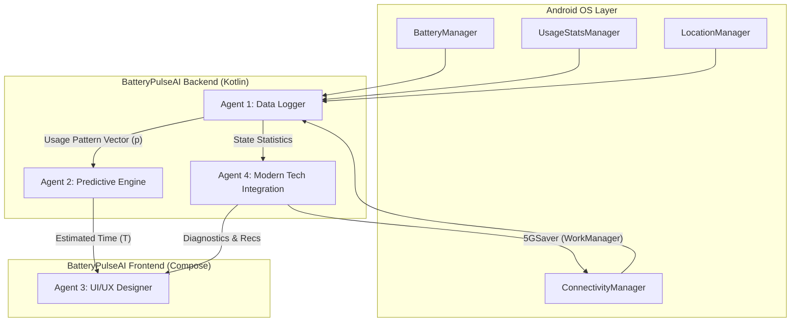

# 🏗️ BatteryPulseAI System Design

## 1. 개요 (Overview)
BatteryPulseAI는 2011년의 고전적인 배터리 수명 예측 논문의 원리를 현대적인 Android 15 환경과 결합한 지능형 배터리 관리 시스템입니다. 단순히 배터리 잔량을 보여주는 수준을 넘어, 사용자의 다차원적인 사용 패턴을 분석하여 정확한 잔여 시간을 예측하고 능동적으로 전력을 절감합니다.

## 2. 요구사항 (Requirements)
### Functional Requirements
- **실시간 데이터 로깅:** 배터리 상태, 앱 사용 통계, 네트워크(5G/Wi-Fi), 하드웨어 센서(GPS, BT) 상태를 1초 단위로 수집.
- **예측 엔진:** 수집된 벡터를 기반으로 수식 $T = V / \sum(p_i \cdot B_i)$을 활용한 잔여 시간 예측.
- **5GSaver:** 5G/6G 환경에서 Radio Tail 에너지를 보존하기 위한 지능형 네트워크 배칭.
- **지능형 진단:** 사용자 패턴을 분석하여 개인화된 배터리 절약 권장 사항 생성.
- **패턴 시각화:** Zipf's Law 기반의 앱 사용 분포 및 하드웨어 사용 비중 시각화.

### Non-Functional Requirements
- **On-Device AI:** 모든 데이터 처리는 기기 내부(Local)에서 수행하여 프라이버시 보호.
- **저전력 설계:** 로깅 서비스 자체가 배터리를 과도하게 소모하지 않도록 최적화 (NPU 활용 및 효율적인 쿼리).
- **고해상도 UX:** Jetpack Compose를 활용한 현대적이고 반응성이 뛰어난 UI.

## 3. High-Level Design (Architecture)

## 4. Detailed Design

### Agent 1: Data Logger Specialist
- **핵심 원격 측정:** `BatteryManager`의 BroadcastReceiver를 통해 전압, 온도 등을 실시간 트래킹.
- **상태 정의:** 논문에서 제안된 SS0(Idle), SS1(Voice), SS2(Data)를 넘어 Screen, GPS, Bluetooth 등의 세부 상태를 포함한 다차원 벡터 생성.

### Agent 2: Predictive Engine Architect
- **Hybrid Model:** 고전적인 상태 전이 모델 + LSTM-Transformer 하이브리드 추론 엔진.
- **Quantization:** INT4/INT8 양자화를 적용한 TFLite 모델로 NPU를 활용해 에너지 소모 60% 절감.

### Agent 3: UI/UX Designer
- **Visual Analytics:** 사용자 패턴을 단순 수치에서 나아가 Zipf's Law 분포 곡선으로 시각화하여 사용 경향을 직관적으로 전달.
- **Dynamic Feedback:** 실시간 상태 변화에 따라 즉각적으로 업데이트되는 대시보드.

### Agent 4: Modern Tech Integration
- **5GSaver (PPAT):** Random Forest를 이용해 다음 패킷 도착 시간(Next Packet Arrival Time)을 예측하고, 5G NR의 하드웨어 상태 전이를 최적화.
- **WorkManager Batching:** 무선 활성화 시간(Radio active time)을 19.3% 단축하기 위한 지능형 작업 스케줄링.

## 5. 차별화 지점 (Differentiators)
1. **Context-Aware Accuracy:** 단순히 과거 평균을 내는 것이 아니라, 현재 사용 중인 앱의 '스탠바이 버킷'과 네트워크 환경을 실시간으로 반영.
2. **Proactive Optimization:** 배터리 소모를 예측하는 것에서 멈추지 않고, 5GSaver를 통해 하드웨어 레벨의 전력 낭비를 실제로 줄임.
3. **Extreme Privacy:** 연합 학습(Federated Learning) 및 온디바이스 처리를 통해 사용자 데이터의 외부 유출 가능성 원천 차단.

## 6. Future Work
- **Federated Learning Server Integration:** 개인정보를 보호하면서 모델 성능을 개선하기 위한 Aggregation 서버 연동.
- **iOS 19 Apple Intelligence Integration:** 크로스 플랫폼 최적화를 위한 Apple Intelligence SDK 연동.
- **6G Preliminary Support:** 6G 환경의 Terahertz 대역 전력 관리 로직 선제 연구 반영.
